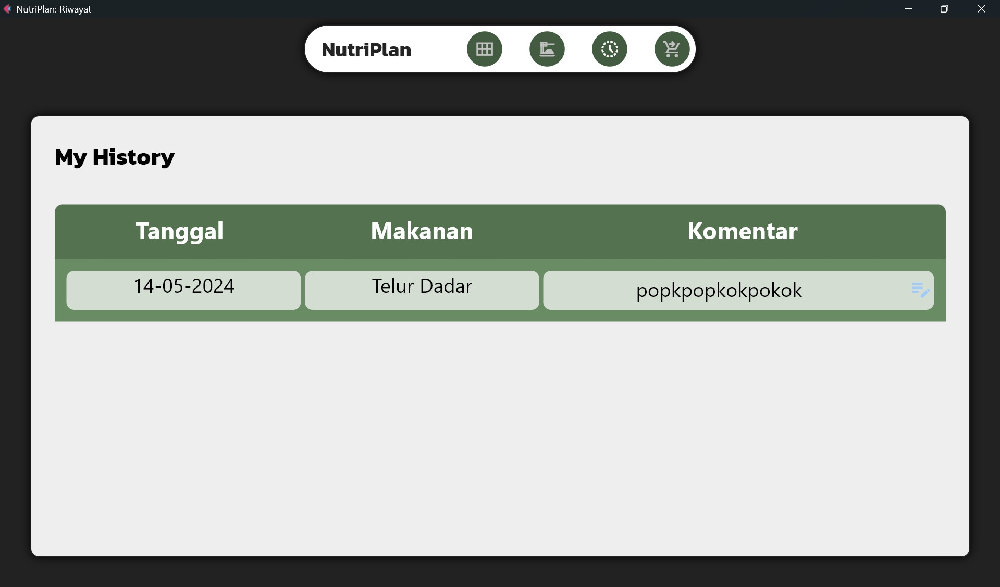

# IF2250-2024-K03-02-NutriPlan
### Menjadikan Hidupmu Lebih Sehat dan Bugar

## Table of Contents
* [General Information](#general-information)
* [Features](#Features)
* [Technology Used](#technoogy-used)
* [Module](#module)
* [Setup](#setup)
* [Usage](#usage)
* [Room for Improvement](#room-for-improvement)
* [Authors](#authors)
## General Information
NutriPlan adalah aplikasi yang dibuat untuk mengatur pola makan dan hidup agar lebih terarah dan sehat. Melalui aplikasi NutriPlan, penjadwalan makanan menjadi lebih mudah dengan fitur-fitur yang ditawarkan.

## Features
- Jadwal Makanan
- Daftar Makanan
- Daftar Belanja
- Daftar Riwayat
- Integrasi Database
- Unit Testing
## Technoogy Used
* python - version 3.12.0
* flet - version 0.22.1
* SQLite3

## Module 
| Daftar Modul | Pembuat | Image | 
| ------------- | ------------- | ------------- |
| Jadwal Makanan  | Rafi  | | 
| Daftar Makanan  | Hugo  | |
| Daftar Belanja  | Zaki |  |
| Daftar Riwayat  | Albert |  |
| Kelas Dasar, <br> Unit Testing  | Niko | |
## Setup
1. Install virtualenv
```
sh
pip install virtualenv
```
2. Create virtualenv
```
sh
virtualenv venv
venv\Scripts\activate
```
3. Install dependencies
```
sh
pip install -r requirements.txt
```
## Usage
- Using Flet 
```
sh
cd src
flet NutriPlan
```
- Using Executable
```sh
cd bin
unzip windows
cd windows
run nutriplan.exe
```
## Authors
* Hugo Sabam Augusto 13522129
* Muhammad Zaki 13522136
* Ahmad Rafi Maliki 13522137
* Nicholas Reymond Sihite 13522144
* Albert Ghazaly 13522150